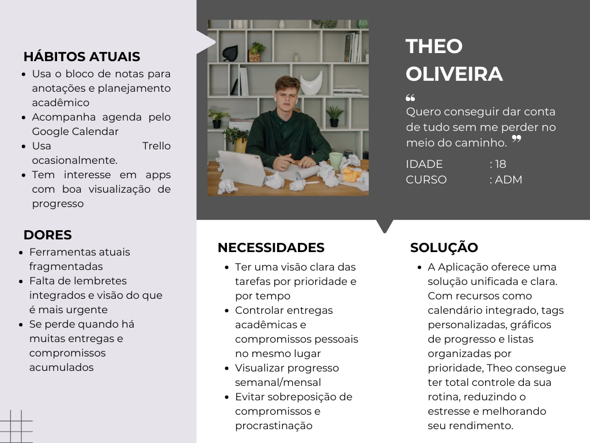
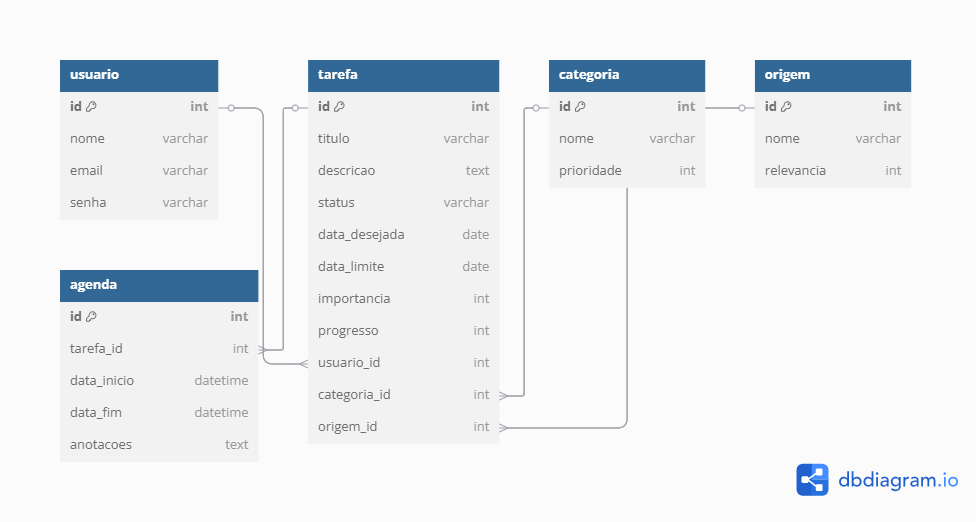
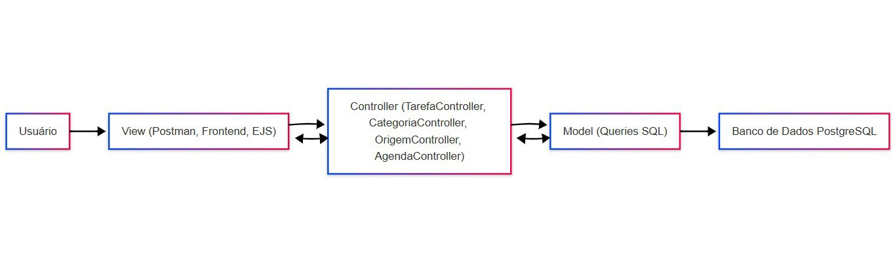
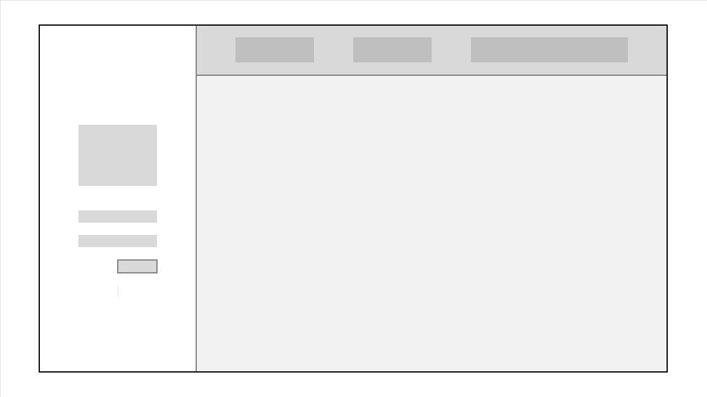
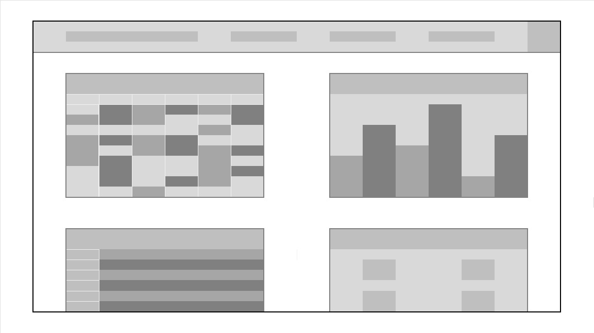
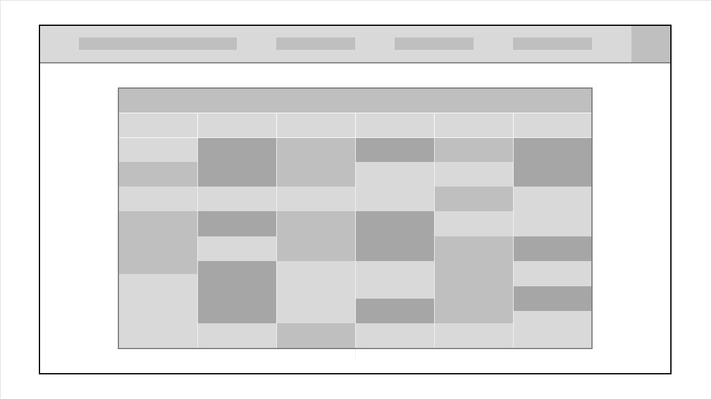
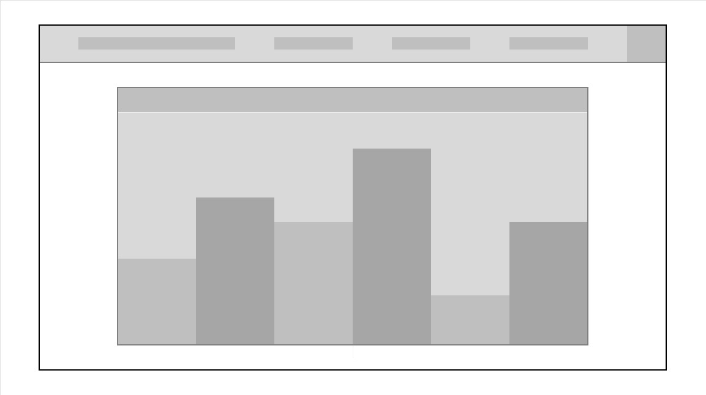
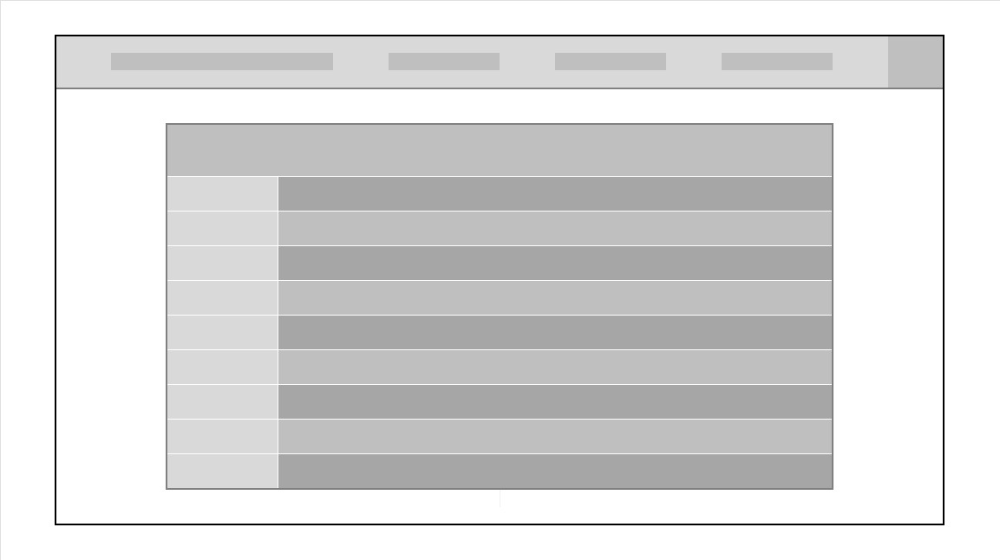

# Web Application Document - Projeto Individual - Módulo 2 - Inteli

## Nome do Projeto: Your Board

#### Autor do projeto: Caio Almeida Mota

## Sumário

1. [Introdução](#c1)  
2. [Visão Geral da Aplicação Web](#c2)  
3. [Projeto Técnico da Aplicação Web](#c3)  
4. [Desenvolvimento da Aplicação Web](#c4)  
5. [Referências](#c5)  

<br>

## <a name="c1"></a>1. Introdução (Semana 01)

**Descrição**:  
O **TaskFlow** é um gerenciador de tarefas voltado para jovens estudantes e profissionais que buscam mais produtividade e clareza em suas rotinas. A ferramenta permite organizar tarefas, acompanhar o progresso semanal com gráficos intuitivos e personalizar categorias conforme suas metas. A aplicação une visualização inteligente de dados com usabilidade leve, sendo ideal para quem precisa conciliar diversas demandas sem se perder.

**Objetivo**:  
Criar um sistema web responsivo e amigável que centralize compromissos e tarefas do usuário, promovendo uma gestão de tempo eficaz, especialmente voltada a estudantes universitários com rotina intensa e múltiplos papéis.

---

## <a name="c2"></a>2. Visão Geral da Aplicação Web

### 2.1. Personas (Semana 01)



---

### 2.2. User Stories (Semana 01)


**US01**  
Como estudante universitário, quero cadastrar e classificar tarefas por prioridade e data, para que eu possa organizar melhor meu tempo.

**US02**  
Como usuário, quero visualizar um gráfico com meu progresso semanal, para que eu entenda como estou performando e o que posso melhorar.

**US03**  
Como estudante, quero vizualizar com destaque as tarefas próximas do prazo, para que eu não perca prazos importantes por esquecimento.

---

### Análise INVEST da US01

**User Story Analisada**:  
*Como estudante universitário, quero cadastrar e classificar tarefas por prioridade e data, para que eu possa organizar melhor meu tempo.*

- **I – Independente:** Pode ser desenvolvida e testada separadamente das outras funcionalidades, como gráficos ou alertas.
- **N – Negociável:** A forma de classificar (por cor, por tags, por números) pode ser discutida e ajustada conforme feedbacks.
- **V – Valiosa:** Traz valor direto ao usuário, pois melhora sua organização e planejamento.
- **E – Estimável:** Pode ser estimada em termos de esforço e tempo para desenvolvimento com clareza.
- **S – Pequena:** Pode ser dividida em sub-tarefas (formulário de tarefa, sistema de prioridade, ordenação).
- **T – Testável:** É possível verificar se o sistema permite cadastro e classificação de tarefas com testes manuais e automatizados.

---

## <a name="c3"></a>3. Projeto da Aplicação Web

### 3.1. Modelagem do banco de dados  (Semana 3)

O banco de dados foi modelado em PostgreSQL, com as seguintes tabelas principais:
- **usuario**: armazena dados dos usuários.
- **tarefa**: armazena tarefas, com campos para título, descrição, status, datas, importância, progresso e chaves estrangeiras para usuário, categoria e origem.
- **categoria**: define categorias de tarefas.
- **origem**: define a origem/contexto da tarefa.
- **agenda**: permite agendar blocos de tempo para tarefas.

## Diagrama Entidade-Relacionamento:



O diagrama relacional representa as tabelas do banco de dados do Your Board, suas chaves primárias (PK), estrangeiras (FK) e os relacionamentos entre entidades como usuário, tarefa, categoria, origem e agenda.

--- 

## Modelo Físico (Schema SQL):

```sql
CREATE TABLE "usuario" (
  "id" INT GENERATED BY DEFAULT AS IDENTITY PRIMARY KEY,
  "nome" varchar,
  "email" varchar UNIQUE,
  "senha" varchar
);

CREATE TABLE "tarefa" (
  "id" INT GENERATED BY DEFAULT AS IDENTITY PRIMARY KEY,
  "titulo" varchar,
  "descricao" text,
  "status" varchar,
  "data_desejada" date,
  "data_limite" date,
  "importancia" int,
  "progresso" int,
  "usuario_id" int,
  "categoria_id" int,
  "origem_id" int
);

CREATE TABLE "categoria" (
  "id" INT GENERATED BY DEFAULT AS IDENTITY PRIMARY KEY,
  "nome" varchar,
  "prioridade" int
);

CREATE TABLE "origem" (
  "id" INT GENERATED BY DEFAULT AS IDENTITY PRIMARY KEY,
  "nome" varchar,
  "relevancia" int
);

CREATE TABLE "agenda" (
  "id" INT GENERATED BY DEFAULT AS IDENTITY PRIMARY KEY,
  "tarefa_id" int,
  "data_inicio" timestamp,
  "data_fim" timestamp,
  "anotacoes" text
);

ALTER TABLE "tarefa" ADD FOREIGN KEY ("usuario_id") REFERENCES "usuario" ("id");
ALTER TABLE "tarefa" ADD FOREIGN KEY ("categoria_id") REFERENCES "categoria" ("id");
ALTER TABLE "tarefa" ADD FOREIGN KEY ("origem_id") REFERENCES "origem" ("id");
ALTER TABLE "agenda" ADD FOREIGN KEY ("tarefa_id") REFERENCES "tarefa" ("id");
```

---

## Estrutura do Banco de Dados

###  Tabela: usuario
**Descrição:** Armazena os dados de cada usuário do sistema.

### Campos:
- **id (PK):** Identificador único do usuário (inteiro autogerado).
- **nome (varchar):** Nome completo.
- **email (varchar):** Email único para login.
- **senha (varchar):** Senha criptografada.

### Relacionamentos:
- **1:N com tarefa** → Um usuário pode ter várias tarefas.

---

###  Tabela: tarefa
**Descrição:** Registra todas as tarefas criadas pelos usuários, com dados de prioridade, prazo e progresso.

### Campos:
- **id (PK):** Identificador da tarefa.
- **titulo (varchar):** Título resumido.
- **descricao (text):** Descrição detalhada.
- **status (varchar):** Situação atual (ex: pendente, em andamento, concluída).
- **data_desejada (date):** Data ideal de entrega.
- **data_limite (date):** Data máxima de entrega.
- **importancia (int):** Grau de importância (escala de 1 a 5, por exemplo).
- **progresso (int):** Percentual concluído da tarefa.
- **usuario_id (FK):** Referência ao usuário criador.
- **categoria_id (FK):** Referência à categoria da tarefa.
- **origem_id (FK):** Referência à origem da tarefa.

### Relacionamentos:
- **N:1 com usuario, categoria e origem.**
- **1:N com agenda.**

---

###  Tabela: categoria
**Descrição:** Classifica as tarefas por tipo (ex: trabalho, estudos, lazer).

### Campos:
- **id (PK):** Identificador da categoria.
- **nome (varchar):** Nome da categoria.
- **prioridade (int):** Grau de prioridade da categoria (ex: 1 a 10).

### Relacionamentos:
- **1:N com tarefa** → Uma categoria pode ter várias tarefas.

---

###  Tabela: origem
**Descrição:** Informa a origem ou contexto da tarefa (ex: faculdade, pessoal, empresa).

### Campos:
- **id (PK):** Identificador.
- **nome (varchar):** Nome da origem.
- **relevancia (int):** Peso da origem na priorização da tarefa.

### Relacionamentos:
- **1:N com tarefa** → Uma origem pode estar vinculada a várias tarefas.

---

### Tabela: agenda
**Descrição:** Permite agendar o tempo de execução de cada tarefa, criando blocos de horário.

### Campos:
- **id (PK):** Identificador.
- **tarefa_id (FK):** Referência à tarefa agendada.
- **data_inicio (datetime):** Início do bloco.
- **data_fim (datetime):** Término do bloco.
- **anotacoes (text):** Notas adicionais.

### Relacionamentos:
- **N:1 com tarefa** → Uma tarefa pode ter vários agendamentos.

---

### 3.1.1 BD e Models (Semana 5)

O banco de dados foi modelado em PostgreSQL, com as seguintes tabelas principais:
- **usuario**: armazena dados dos usuários.
- **tarefa**: armazena tarefas, com campos para título, descrição, status, datas, importância, progresso e chaves estrangeiras para usuário, categoria e origem.
- **categoria**: define categorias de tarefas.
- **origem**: define a origem/contexto da tarefa.
- **agenda**: permite agendar blocos de tempo para tarefas.

#### Script de criação das tabelas (init.sql):
```sql
CREATE TABLE "usuario" (
  "id" INT GENERATED BY DEFAULT AS IDENTITY PRIMARY KEY,
  "nome" varchar,
  "email" varchar UNIQUE,
  "senha" varchar
);

CREATE TABLE "tarefa" (
  "id" INT GENERATED BY DEFAULT AS IDENTITY PRIMARY KEY,
  "titulo" varchar,
  "descricao" text,
  "status" varchar,
  "data_desejada" date,
  "data_limite" date,
  "importancia" int,
  "progresso" int,
  "usuario_id" int,
  "categoria_id" int,
  "origem_id" int
);

CREATE TABLE "categoria" (
  "id" INT GENERATED BY DEFAULT AS IDENTITY PRIMARY KEY,
  "nome" varchar,
  "prioridade" int
);

CREATE TABLE "origem" (
  "id" INT GENERATED BY DEFAULT AS IDENTITY PRIMARY KEY,
  "nome" varchar,
  "relevancia" int
);

CREATE TABLE "agenda" (
  "id" INT GENERATED BY DEFAULT AS IDENTITY PRIMARY KEY,
  "tarefa_id" int,
  "data_inicio" timestamp,
  "data_fim" timestamp,
  "anotacoes" text
);

ALTER TABLE "tarefa" ADD FOREIGN KEY ("usuario_id") REFERENCES "usuario" ("id");
ALTER TABLE "tarefa" ADD FOREIGN KEY ("categoria_id") REFERENCES "categoria" ("id");
ALTER TABLE "tarefa" ADD FOREIGN KEY ("origem_id") REFERENCES "origem" ("id");
ALTER TABLE "agenda" ADD FOREIGN KEY ("tarefa_id") REFERENCES "tarefa" ("id");
```

---

### 3.1.2 Implementação dos Models

Os models foram criados para cada tabela principal, centralizando as queries SQL e facilitando a manutenção do código. Exemplo de model para tarefas:

```js
// models/tarefaModel.js
const db = require('../config/db');

exports.criarTarefa = (dados) => {
  const query = `INSERT INTO tarefa (titulo, descricao, status, data_desejada, data_limite, importancia, progresso, usuario_id, categoria_id, origem_id)
    VALUES ($1, $2, $3, $4, $5, $6, $7, $8, $9, $10) RETURNING *`;
  return db.query(query, dados);
};

exports.listarTarefas = () => {
  return db.query('SELECT * FROM tarefa');
};
```

---

### 3.1.3 Implementação dos Controllers

Os controllers recebem as requisições HTTP, validam os dados e utilizam os models para acessar o banco de dados. Exemplo de controller para tarefas:

```js
// controllers/TarefaController.js
const tarefaModel = require('../models/tarefaModel');

exports.criarTarefa = async (req, res) => {
  const { titulo, descricao, status, data_desejada, data_limite, importancia, progresso, usuario_id, categoria_id, origem_id } = req.body;
  const values = [titulo, descricao, status, data_desejada, data_limite, importancia, progresso, usuario_id, categoria_id, origem_id];
  try {
    const result = await tarefaModel.criarTarefa(values);
    res.status(201).json(result.rows[0]);
  } catch (err) {
    res.status(500).json({ error: err.message });
  }
};
```

---

### 3.2. Arquitetura (Semana 5)



O projeto segue o padrão **MVC**:

Model: queries SQL e manipulação dos dados.
Controller: lógica de negócio e validação.
Routes: URLs conectando aos controllers.

View: (opcional, pode ser frontend ou Postman/Insomnia).

Fluxo:
Usuário → View → Controller → Model → Banco de Dados → Controller → View → Usuário

### 3.3. Wireframes (Semana 03)

Os **Wireframes** são representações visuais fundamentais no processo de desenvolvimento de produtos digitais. Eles ajudam a validar a estrutura da interface, a navegação entre telas e a experiência do usuário antes da implementação visual definitiva e do desenvolvimento de código. Essa etapa permite alinhar expectativas entre a equipe de projeto e os stakeholders, reduzindo riscos e garantindo uma solução mais eficiente.

No contexto do projeto Your Board, foi desenvolvido um wireframe de média fidelidade, focado em representar de forma mais realista a interface do sistema, com elementos visuais mais refinados e distribuição funcional mais próxima do produto final. O objetivo principal foi transformar os fluxos de navegação mapeados anteriormente no User Flow em telas concretas, que atendessem às User Stories levantadas ao longo do planejamento.

#### **Tela de login**

Tela inicial de acesso ao sistema. O usuário insere seu e-mail e senha para autenticação. É o ponto de entrada principal da aplicação, garantindo segurança e acesso individualizado às tarefas.

#### **Tela de Início**


Painel central do sistema onde o usuário visualiza um resumo de cada funcionalidade principal do sistema:

1. Agenda com as tarefas programadas
2. Gráficos com indicadores visuais de produtividade
3. Diário para registros e reflexões diárias
4. Atalhos para ações rápidas

Essa tela oferece uma visão consolidada do dia e ajuda o usuário a tomar decisões rápidas.

#### **Tela Agenda**


Apresenta as tarefas organizadas por data e horário, permitindo ao usuário planejar e acompanhar suas atividades ao longo da semana ou do mês.

#### **Tela Gráficos**


Exibe indicadores visuais de desempenho, como progresso de tarefas, tarefas concluídas por categoria ou origem, e análise de prioridades. Ajuda o usuário a monitorar sua produtividade e focar no que importa.

#### **Tela Diário**


Espaço destinado a anotações e reflexões pessoais sobre o dia. Pode ser usado para registrar aprendizados, obstáculos ou ideias importantes.

#### **Tela Atalhos**


Oferece botões rápidos para criação de tarefas, adição de anotações, visualização do calendário ou filtros personalizados. Otimiza o tempo do usuário ao acessar funções frequentes com apenas um clique.

### 3.4. Guia de estilos (Semana 05)

*Descreva aqui orientações gerais para o leitor sobre como utilizar os componentes do guia de estilos de sua solução.*

### 3.5. Protótipo de alta fidelidade (Semana 05)

*Posicione aqui algumas imagens demonstrativas de seu protótipo de alta fidelidade e o link para acesso ao protótipo completo (mantenha o link sempre público para visualização).*

### 3.6. WebAPI e endpoints (Semana 05)

As rotas foram criadas para cada entidade, permitindo o acesso às funções de CRUD:
- `/tarefas` (POST, GET, PUT, DELETE)
- `/categorias` (POST, GET, PUT, DELETE)
- `/origens` (POST, GET, PUT, DELETE)
- `/agendas` (POST, GET, PUT, DELETE)

Exemplo de rota:
```js
// routes/tarefaRoutes.js
const express = require('express');
const router = express.Router();
const TarefaController = require('../controllers/TarefaController');

router.post('/', TarefaController.criarTarefa);
router.get('/', TarefaController.listarTarefas);
router.put('/:id', TarefaController.editarTarefa);
router.delete('/:id', TarefaController.excluirTarefa);

module.exports = router;
```


### 3.7 Interface e Navegação (Semana 07)

*Descreva e ilustre aqui o desenvolvimento do frontend do sistema web, explicando brevemente o que foi entregue em termos de código e sistema. Utilize prints de tela para ilustrar.*

---

### <a name="c4"></a>4. Desenvolvimento da Aplicação Web (Semana 8)

Até a semana 5, o backend do sistema está completo para as operações CRUD das principais entidades, com integração ao banco de dados PostgreSQL, arquitetura MVC e documentação dos endpoints.

### 4.1 Demonstração do Sistema Web (Semana 8)

*VIDEO: Insira o link do vídeo demonstrativo nesta seção*
*Descreva e ilustre aqui o desenvolvimento do sistema web completo, explicando brevemente o que foi entregue em termos de código e sistema. Utilize prints de tela para ilustrar.*

### 4.2 Conclusões e Trabalhos Futuros (Semana 8)

*Indique pontos fortes e pontos a melhorar de maneira geral.*
*Relacione também quaisquer outras ideias que você tenha para melhorias futuras.*


## <a name="c5"></a>5. Referências

_Incluir as principais referências de seu projeto, para que seu parceiro possa consultar caso ele se interessar em aprofundar. Um exemplo de referência de livro e de site:_<br>

---
---

[def]: ssets\Persona.pn