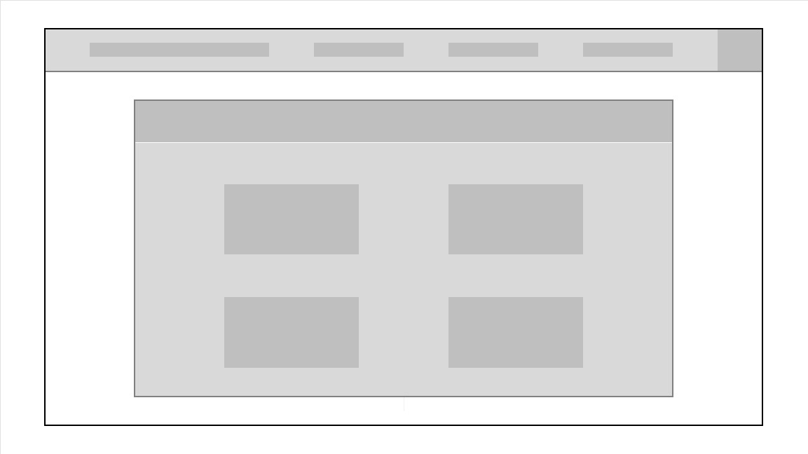

# Web Application Document - Projeto Individual - Módulo 2 - Inteli

## Nome do Projeto: Your Board

#### Autor do projeto: Caio Almeida Mota

## Sumário

1. [Introdução](#c1)  
2. [Visão Geral da Aplicação Web](#c2)  
3. [Projeto Técnico da Aplicação Web](#c3)  
4. [Desenvolvimento da Aplicação Web](#c4)  
5. [Referências](#c5)  

 

## 1. Introdução (Semana 01)

**Descrição**:  
O **TaskFlow** é um gerenciador de tarefas voltado para jovens estudantes e profissionais que buscam mais produtividade e clareza em suas rotinas. A ferramenta permite organizar tarefas, acompanhar o progresso semanal com gráficos intuitivos e personalizar categorias conforme suas metas. A aplicação une visualização inteligente de dados com usabilidade leve, sendo ideal para quem precisa conciliar diversas demandas sem se perder.

**Objetivo**:  
Criar um sistema web responsivo e amigável que centralize compromissos e tarefas do usuário, promovendo uma gestão de tempo eficaz, especialmente voltada a estudantes universitários com rotina intensa e múltiplos papéis.

---

## 2. Visão Geral da Aplicação Web

### 2.1. Personas (Semana 01)

---

### 2.2. User Stories (Semana 01)

**US01**  
Como estudante universitário, quero cadastrar e classificar tarefas por prioridade e data, para que eu possa organizar melhor meu tempo.

**US02**  
Como usuário, quero visualizar um gráfico com meu progresso semanal, para que eu entenda como estou performando e o que posso melhorar.

**US03**  
Como estudante, quero vizualizar com destaque as tarefas próximas do prazo, para que eu não perca prazos importantes por esquecimento.

---

### Análise INVEST da US01

**User Story Analisada**:  
*Como estudante universitário, quero cadastrar e classificar tarefas por prioridade e data, para que eu possa organizar melhor meu tempo.*

- **I – Independente:** Pode ser desenvolvida e testada separadamente das outras funcionalidades, como gráficos ou alertas.
- **N – Negociável:** A forma de classificar (por cor, por tags, por números) pode ser discutida e ajustada conforme feedbacks.
- **V – Valiosa:** Traz valor direto ao usuário, pois melhora sua organização e planejamento.
- **E – Estimável:** Pode ser estimada em termos de esforço e tempo para desenvolvimento com clareza.
- **S – Pequena:** Pode ser dividida em sub-tarefas (formulário de tarefa, sistema de prioridade, ordenação).
- **T – Testável:** É possível verificar se o sistema permite cadastro e classificação de tarefas com testes manuais e automatizados.

---

## 3. Projeto da Aplicação Web

### 3.1. Modelagem do banco de dados  (Semana 3)

3.1. Modelagem do Banco de Dados (Semana 03)
O banco de dados do TaskFlow foi modelado para garantir escalabilidade e facilidade de manutenção. Ele é estruturado de forma relacional e utiliza PostgreSQL. As principais entidades são:

Usuário: informações básicas do usuário.

Tarefa: dados sobre cada atividade cadastrada.

Categoria: tipos de tarefas ou áreas da vida do usuário.

Sessão: controle de login/autenticação.

Progresso: dados que alimentam os gráficos de desempenho.

## Diagrama Entidade-Relacionamento:

O diagrama relacional representa as tabelas do banco de dados do Your Board, suas chaves primárias (PK), estrangeiras (FK) e os relacionamentos entre entidades como usuário, tarefa, categoria, origem e agenda.

--- 

## Modelo Físico (Schema SQL):
CREATE TABLE "usuario" (
  "id" INT GENERATED BY DEFAULT AS IDENTITY PRIMARY KEY,
  "nome" varchar,
  "email" varchar UNIQUE,
  "senha" varchar
);

CREATE TABLE "tarefa" (
  "id" INT GENERATED BY DEFAULT AS IDENTITY PRIMARY KEY,
  "titulo" varchar,
  "descricao" text,
  "status" varchar,
  "data_desejada" date,
  "data_limite" date,
  "importancia" int,
  "progresso" int,
  "usuario_id" int,
  "categoria_id" int,
  "origem_id" int
);

CREATE TABLE "categoria" (
  "id" INT GENERATED BY DEFAULT AS IDENTITY PRIMARY KEY,
  "nome" varchar,
  "prioridade" int
);

CREATE TABLE "origem" (
  "id" INT GENERATED BY DEFAULT AS IDENTITY PRIMARY KEY,
  "nome" varchar,
  "relevancia" int
);

CREATE TABLE "agenda" (
  "id" INT GENERATED BY DEFAULT AS IDENTITY PRIMARY KEY,
  "tarefa_id" int,
  "data_inicio" datetime,
  "data_fim" datetime,
  "anotacoes" text
);

ALTER TABLE "tarefa" ADD FOREIGN KEY ("usuario_id") REFERENCES "usuario" ("id");

ALTER TABLE "tarefa" ADD FOREIGN KEY ("categoria_id") REFERENCES "categoria" ("id");

ALTER TABLE "tarefa" ADD FOREIGN KEY ("origem_id") REFERENCES "origem" ("id");

ALTER TABLE "agenda" ADD FOREIGN KEY ("tarefa_id") REFERENCES "tarefa" ("id");

---

## Estrutura do Banco de Dados

###  Tabela: usuario
**Descrição:** Armazena os dados de cada usuário do sistema.

### Campos:
- **id (PK):** Identificador único do usuário (inteiro autogerado).
- **nome (varchar):** Nome completo.
- **email (varchar):** Email único para login.
- **senha (varchar):** Senha criptografada.

### Relacionamentos:
- **1:N com tarefa** → Um usuário pode ter várias tarefas.

---

###  Tabela: tarefa
**Descrição:** Registra todas as tarefas criadas pelos usuários, com dados de prioridade, prazo e progresso.

### Campos:
- **id (PK):** Identificador da tarefa.
- **titulo (varchar):** Título resumido.
- **descricao (text):** Descrição detalhada.
- **status (varchar):** Situação atual (ex: pendente, em andamento, concluída).
- **data_desejada (date):** Data ideal de entrega.
- **data_limite (date):** Data máxima de entrega.
- **importancia (int):** Grau de importância (escala de 1 a 5, por exemplo).
- **progresso (int):** Percentual concluído da tarefa.
- **usuario_id (FK):** Referência ao usuário criador.
- **categoria_id (FK):** Referência à categoria da tarefa.
- **origem_id (FK):** Referência à origem da tarefa.

### Relacionamentos:
- **N:1 com usuario, categoria e origem.**
- **1:N com agenda.**

---

###  Tabela: categoria
**Descrição:** Classifica as tarefas por tipo (ex: trabalho, estudos, lazer).

### Campos:
- **id (PK):** Identificador da categoria.
- **nome (varchar):** Nome da categoria.
- **prioridade (int):** Grau de prioridade da categoria (ex: 1 a 10).

### Relacionamentos:
- **1:N com tarefa** → Uma categoria pode ter várias tarefas.

---

###  Tabela: origem
**Descrição:** Informa a origem ou contexto da tarefa (ex: faculdade, pessoal, empresa).

### Campos:
- **id (PK):** Identificador.
- **nome (varchar):** Nome da origem.
- **relevancia (int):** Peso da origem na priorização da tarefa.

### Relacionamentos:
- **1:N com tarefa** → Uma origem pode estar vinculada a várias tarefas.

---

### Tabela: agenda
**Descrição:** Permite agendar o tempo de execução de cada tarefa, criando blocos de horário.

### Campos:
- **id (PK):** Identificador.
- **tarefa_id (FK):** Referência à tarefa agendada.
- **data_inicio (datetime):** Início do bloco.
- **data_fim (datetime):** Término do bloco.
- **anotacoes (text):** Notas adicionais.

### Relacionamentos:
- **N:1 com tarefa** → Uma tarefa pode ter vários agendamentos.

---

### 3.1.1 BD e Models (Semana 5)

Os models do sistema seguem a estrutura MVC, mas como não foi utilizado ORM, as queries SQL estão implementadas diretamente nos controllers.

---

### 3.2. Arquitetura (Semana 5)

IMAGEM DIAGRAMA

Explicação:
O usuário interage com a View (pode ser o frontend, Postman ou Insomnia), que envia requisições HTTP para o Controller. O Controller processa a lógica de negócio e acessa o Model, que executa comandos SQL no banco de dados. O resultado retorna para o Controller, que responde para a View.

### 3.3. Wireframes (Semana 03)

Os **Wireframes** são representações visuais fundamentais no processo de desenvolvimento de produtos digitais. Eles ajudam a validar a estrutura da interface, a navegação entre telas e a experiência do usuário antes da implementação visual definitiva e do desenvolvimento de código. Essa etapa permite alinhar expectativas entre a equipe de projeto e os stakeholders, reduzindo riscos e garantindo uma solução mais eficiente.

No contexto do projeto Your Board, foi desenvolvido um wireframe de média fidelidade, focado em representar de forma mais realista a interface do sistema, com elementos visuais mais refinados e distribuição funcional mais próxima do produto final. O objetivo principal foi transformar os fluxos de navegação mapeados anteriormente no User Flow em telas concretas, que atendessem às User Stories levantadas ao longo do planejamento.

#### **Tela de login**

#### **Tela de login**

#### **Tela Agenda**

#### **Tela Gráficos**

#### **Tela Diário**

#### **Tela Atalhos**

### 3.4. Guia de estilos (Semana 05)

*Descreva aqui orientações gerais para o leitor sobre como utilizar os componentes do guia de estilos de sua solução.*

### 3.5. Protótipo de alta fidelidade (Semana 05)

*Posicione aqui algumas imagens demonstrativas de seu protótipo de alta fidelidade e o link para acesso ao protótipo completo (mantenha o link sempre público para visualização).*

### 3.6. WebAPI e endpoints (Semana 05)

(Semana 05)
Tarefas
POST /tarefas - Cria uma nova tarefa
GET /tarefas - Lista todas as tarefas
PUT /tarefas/:id - Edita uma tarefa
DELETE /tarefas/:id - Exclui uma tarefa
Categorias
POST /categorias - Cria uma nova categoria
GET /categorias - Lista todas as categorias
PUT /categorias/:id - Edita uma categoria
DELETE /categorias/:id - Exclui uma categoria
Origens
POST /origens - Cria uma nova origem
GET /origens - Lista todas as origens
PUT /origens/:id - Edita uma origem
DELETE /origens/:id - Exclui uma origem  
Agendas
POST /agendas - Cria um novo agendamento
GET /agendas - Lista todos os agendamentos
PUT /agendas/:id - Edita um agendamento
DELETE /agendas/:id - Exclui um agendamento

Exemplo de requisição para criar tarefa:
{
  "titulo": "Estudar para prova",
  "descricao": "Revisar capítulos 1 a 3",
  "status": "pendente",
  "data_desejada": "2024-06-10",
  "data_limite": "2024-06-15",
  "importancia": 5,
  "progresso": 0,
  "usuario_id": 1,
  "categoria_id": 1,
  "origem_id": 1
}

### 3.7 Interface e Navegação (Semana 07)

*Descreva e ilustre aqui o desenvolvimento do frontend do sistema web, explicando brevemente o que foi entregue em termos de código e sistema. Utilize prints de tela para ilustrar.*

---

## 4. Desenvolvimento da Aplicação Web (Semana 8)

### 4.1 Demonstração do Sistema Web (Semana 8)

*VIDEO: Insira o link do vídeo demonstrativo nesta seção*
*Descreva e ilustre aqui o desenvolvimento do sistema web completo, explicando brevemente o que foi entregue em termos de código e sistema. Utilize prints de tela para ilustrar.*

### 4.2 Conclusões e Trabalhos Futuros (Semana 8)

*Indique pontos fortes e pontos a melhorar de maneira geral.*
*Relacione também quaisquer outras ideias que você tenha para melhorias futuras.*

## 5. Referências

_Incluir as principais referências de seu projeto, para que seu parceiro possa consultar caso ele se interessar em aprofundar. Um exemplo de referência de livro e de site:_ 

---
---

[def]: ssets\Persona.pn